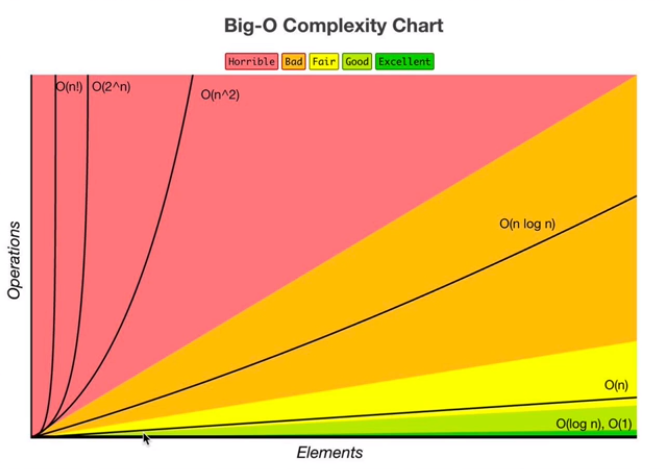

## Data Structures Notebooks

This is a notebook that gathers some of the most important data structures and how they are implemented.

* **Array**
* **Hash Tables**
* **Linked Lists**
* **Queues**
* **Stacks**

## Time Complexity

* Big O Complexity Chart

